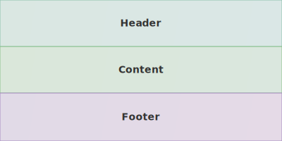
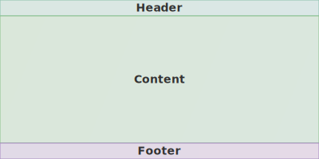
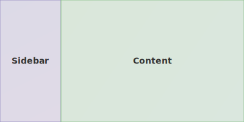
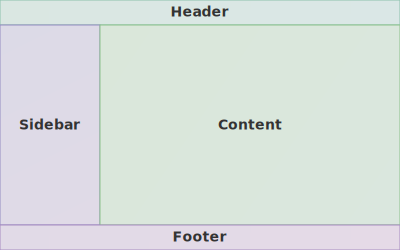
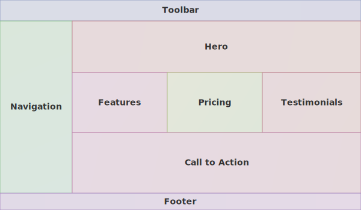
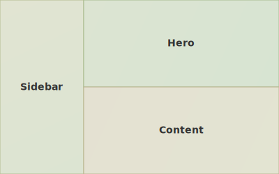
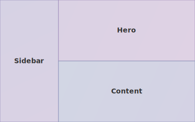
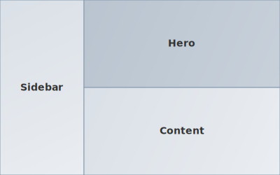
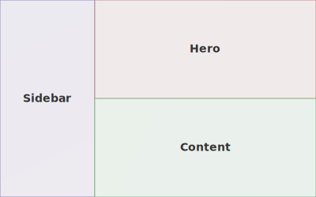

# asciidoctor-diagram-layout

An Asciidoctor extension for documenting UI layouts as diagrams.

## The problem

When writing software requirements or design documents, you often need
to describe the layout of a screen or a page: which areas exist, how
they are positioned relative to each other, and what proportion of
space each one occupies.

The usual alternatives are screenshots, wireframe tools, or hand-drawn
sketches - none of which live well next to the text, can be diffed in
version control, or stay in sync as the design evolves.

This extension lets you describe a layout directly in AsciiDoc source
using a simple line-oriented DSL.
The same source serves as both a human-readable description of the
structure and a machine-rendered visual diagram - there is no separate
"source" and "picture" to keep in sync.
The diagram is rendered as HTML (for web output) or SVG (for PDF and
other backends) without any external tools.

## Installation

Add to your `Gemfile`:

```ruby
gem "asciidoctor-diagram-layout"
```

Or install directly:

```
gem install asciidoctor-diagram-layout
```

## Usage

Pass `-r asciidoctor-diagram-layout` to the Asciidoctor CLI:

```
asciidoctor -r asciidoctor-diagram-layout doc.adoc
```

## Examples

### Single column layout

The simplest case: a vertical stack of areas.
Top-level cells without an explicit container are stacked
vertically by default.

```asciidoc
[layout-rowcol, width="400px", height="200px"]
----
cell: Header
cell: Content
cell: Footer
----
```



### Fixed-size header and footer

A number in parentheses sets the size as a percentage of the
parent.
The remaining space is distributed equally among auto-sized
cells.

```asciidoc
[layout-rowcol, width="400px", height="200px"]
----
cell(20): Header
cell: Content
cell(20): Footer
----
```



### Two-column layout with a sidebar

```asciidoc
[layout-rowcol, width="400px", height="200px"]
----
cols:
  cell(25): Sidebar
  cell: Content
----
```



### Classic page layout

A header and footer at fixed height, with a sidebar and main
content area in between.

```asciidoc
[layout-rowcol, width="400px", height="250px"]
----
cell(20): Header
cols:
  cell(25): Sidebar
  cell: Content
cell(20): Footer
----
```



### Dashboard with nested sections

Nesting `rows:` and `cols:` containers produces complex grids.

```asciidoc
[layout-rowcol, width="600px", height="350px"]
----
cell(10): Toolbar
cols:
  cell(20): Navigation
  rows:
    cell(30): Hero
    cols:
      cell: Features
      cell: Pricing
      cell: Testimonials
    cell: Call to Action
cell(8): Footer
----
```



### Referencing document sections

Cell names support AsciiDoc `xref:` macros.
The cross-reference is preserved in HTML output and stripped to the
display label in SVG output.

```asciidoc
[layout-rowcol]
----
cell(10): xref:header[Header]
cols:
  cell(25): xref:sidebar[Sidebar]
  cell: xref:content[Content]
cell(10): xref:footer[Footer]
----
```

### Color palettes

The `palette` attribute controls the color scheme.
Available values: `rainbow` (default), `warm`, `cool`, `mono`, `pastel`.

`warm`:



`cool`:



`mono`:



`pastel`:



### PDF output

When converting to PDF the diagram is written as an SVG file and
embedded as an image.
Use the `target` attribute to set the output file name:

```asciidoc
[layout-rowcol, target="page-layout"]
----
cell(10): Header
cell: Content
cell(10): Footer
----
```

## DSL syntax

Each line declares one node.
Indentation (4 spaces or one tab) defines nesting.

* `rows:` - container that arranges children vertically
* `cols:` - container that arranges children horizontally
* `cell: Name` - leaf cell with a visible label
* `cell(N): Name` - leaf cell with a fixed size of N% of its parent
* Containers and cells without an explicit size share the remaining
  space equally
* Top-level nodes without an explicit container are wrapped in a
  vertical (`rows`) container by default
* Lines starting with `#` are comments

## Block attributes

* `direction` - implicit direction when no top-level container is
  declared: `rows` (default) or `cols`
* `renderer` - force output format: `html` or `svg`; defaults to
  `html` for HTML backends and `svg` for all others including PDF
* `palette` - color scheme: `rainbow` (default), `pastel`, `warm`,
  `cool`, `mono`
* `width` - diagram width, e.g. `100%` (default) or `800px`
* `height` - diagram height, e.g. `400px`; not set by default
* `target` - SVG file name without extension, used when rendering
  to PDF

## License

Apache License 2.0.
See [LICENSE](LICENSE).
